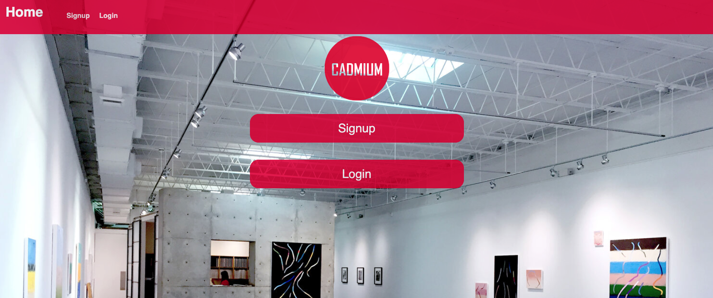
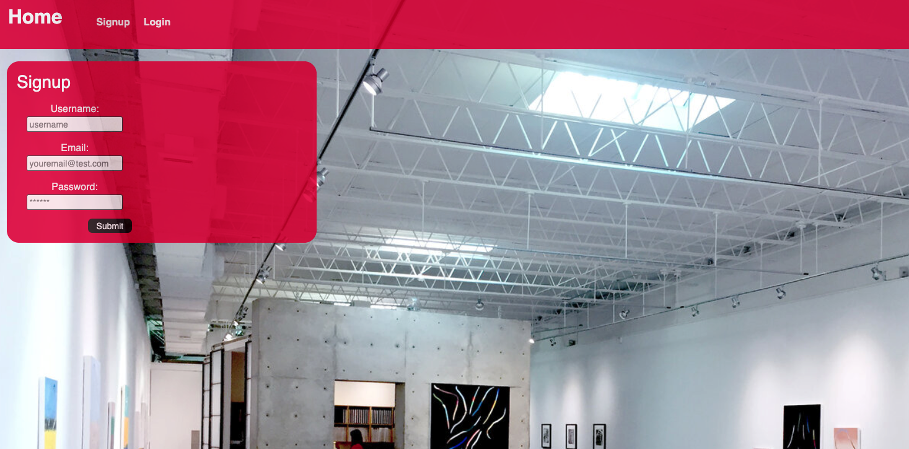
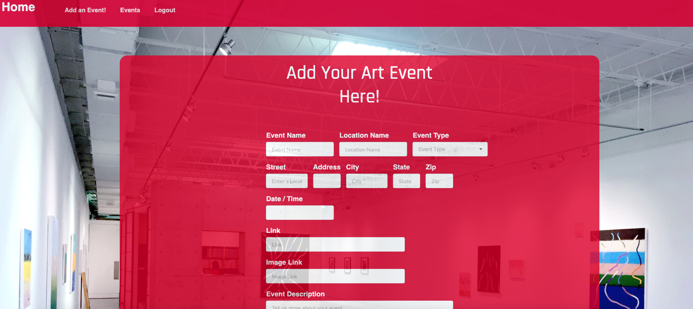
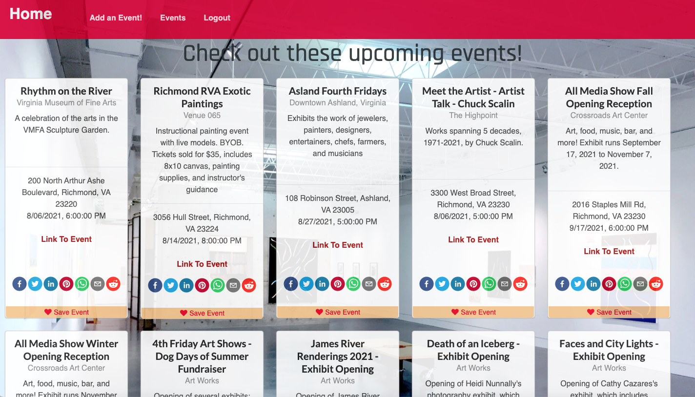

# Cadmium-RVA

## Description

This application presents the user with listings by date of art events happening in Richmond, VA. The user will be able to create their own event postings, but they will be required to login or create an account before doing so. Users are also be able to email the event links to themselves or a friend, as well as share accross an array of social media platforms.

Future functionality: Users are able to save a personal list of events with the option to print, email, share on social media, or plot on a map.

## Table of Contents

1. [Technologies Used](#Technologies-Used)
2. [User Story](#User-Story)
3. [Acceptance Criteria](#Acceptance-Criteria)
4. [Application Requirements](#Application-Requirements)
5. [Mock Up](#Mock-Up)
6. [Usage](#Usage)
7. [Contact](#Contact)
8. [License](#License)

## Technologies Used

```
1. React JS
2. GraphQL
3. JavaScript
4. Node.js
5. Express.js
6. HTML and CSS
7. Semantic UI (for styling)
8. Authentication (JWT)
9. MongoDB and Mongoose ODM
10. Apollo Server
11. Queries and Mutations
12. TypeDefs and Resolvers
13. React-Share (package to utilize socia media)

# UPDATE THESE if we use or do not use them
14. Manifest.json
15. Service worker (for offline functionality)
16. PWA (it is a PWA if it has 14 and 15 and is installable)
```

## User Story

```md
AS AN art enthusiast in Richmond, Va
I WANT to find upcoming art events
SO THAT I can plan out when/where they’re happening.
```

## Acceptance Criteria

<!-- UPDATE UPDATE UPDATE -->

```md
GIVEN a React art events site:
WHEN I visit the site for the first time,
THEN I am presented with the landing page, which presents me with the options to login or create an account.
WHEN I choose to create an account,
THEN I am prompted to create a username and password and enter an email address.
WHEN I click on the login button,
THEN my user credentials are saved and I am logged into the site.
WHEN I revisit the site at a later time and choose to sign in,
THEN I am prompted to enter my username and password.
WHEN I am signed in to the site,
THEN I see navigation links for the events page, the add event page, and the logout button.
WHEN I click on the homepage option in the navigation,
THEN I am taken to the homepage and presented with existing art events that include the event title, date, time, venue name, venue address, brief description, potentially an image related to the specific event, and potentially a link to the event.
WHEN I click on the create an event option in the navigation,
THEN I am taken to the add event page and presented with the option to add a new event.
WHEN I click on the button to add a new art event,
THEN I am prompted to enter the event title, date, time, venue name, venue address, brief description, an image link related to the specific event (if I have one), and a link to the event (if I have one).
WHEN I click on the button to create a new event,
THEN the event title, date, time, venue name, venue address, brief description, and respective links are saved, and I am taken back to the homepage with my new event added at the bottom of the list.
WHEN I click on the logout option in the navigation,
THEN I am signed out of the site.
WHEN I am idle on the site for more than a set time,
THEN I am prompted to log in again before I can view events.
```

## Application Requirements

```md
- Must use GraphQL with a Node.js and Express.js server
- Must use MongoDB and Mongoose ODM for the database
- Must have queries and mutations for retrieving, adding, updating, and deleting data
- Must be deployed using Heroku (with data)
- Must have a polished UI
- Must be interactive (i.e., accept and respond to user input)
- Must include authentication (JWT)
- Must protect sensitive API key information on the server
- Must have a high-quality README (with unique name, description, technologies used, screenshot, and link to the deployed app)
- Must meet good-quality coding standards (file structure, best practices, etc.)
- Must look professional and be mobile-friendly
```

## Mock-Up

The following photos provide a mock-up of the application:

<!-- These are just a starter - we can change as we like of course -->

1. Home Page
   

2. Signup Page
   

5. Add event page
   
4. Events page
   
   

## Heroku Link

The following link leads to the deployed application on Heroku:

[Heroku Link](https://cadmiumrva.herokuapp.com/)

## Usage

This application is deployed to Heroku. However, if you would like to run this application locally, run the following commands in the cloned repo:

1. Install dependencies: `npm install` (Ensure this also installs graphql. If it does not, run `npm install graphql`).

2. Seed the database: `npm run seed`.

3. Create an optimized production build: `npm run build`.

4. Start the application: `npm run develop`.

## Contact

If you have any questions about the repo, contact the following contributors:

- [Casey Johnson](https://github.com/johnsoncm)
- [Seth Vance](https://github.com/sethvance26)
- [Erick McNeil](https://github.com/ErickMcNeil)
- [Catherine Smith](https://github.com/crsmith01)

## License

[](https://opensource.org/licenses/MIT)
Copyright 2021 Cadmium
Permission is hereby granted, free of charge, to any person obtaining a copy of this software and associated documentation files (the "Software"), to deal in the Software without restriction, including without limitation the rights to use, copy, modify, merge, publish, distribute, sublicense, and/or sell copies of the Software, and to permit persons to whom the Software is furnished to do so, subject to the following conditions:
The above copyright notice and this permission notice shall be included in all copies or substantial portions of the Software.
THE SOFTWARE IS PROVIDED "AS IS", WITHOUT WARRANTY OF ANY KIND, EXPRESS OR IMPLIED, INCLUDING BUT NOT LIMITED TO THE WARRANTIES OF MERCHANTABILITY, FITNESS FOR A PARTICULAR PURPOSE AND NONINFRINGEMENT. IN NO EVENT SHALL THE AUTHORS OR COPYRIGHT HOLDERS BE LIABLE FOR ANY CLAIM, DAMAGES OR OTHER LIABILITY, WHETHER IN AN ACTION OF CONTRACT, TORT OR OTHERWISE, ARISING FROM, OUT OF OR IN CONNECTION WITH THE SOFTWARE OR THE USE OR OTHER DEALINGS IN THE SOFTWARE.
